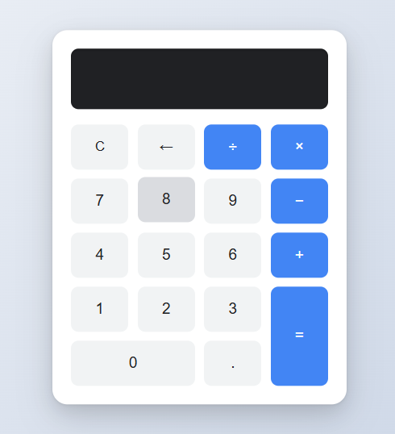

# Vanilla JavaScript Calculator

## 📌 Описание проекта

Простой интерактивный калькулятор, реализованный с использованием чистого JavaScript, HTML и CSS без сторонних библиотек или фреймворков.

**Цель проекта** — развить и подтвердить практические навыки программирования на JavaScript, включая работу с DOM, событиями, обработкой данных, пользовательским вводом и организацией кода в модульной структуре. Проект должен показать умение создавать интерактивные, понятные и поддерживаемые интерфейсы без использования сторонних фреймворков.

---

## ⚙️ Установка и запуск проекта

1. Склонируйте или скачайте проект к себе на компьютер.
2. Убедитесь, что в папке проекта находятся следующие файлы:
   - `index.html`
   - `main.js`
   - `calculator.js`
3. **ВАЖНО:** для корректной работы модульной структуры JavaScript откройте проект через локальный сервер.

### 🔧 Пример запуска через локальный сервер (если установлен Python):

Откройте терминал в папке проекта и выполните:

- Для Python 3:
  ```bash
  python -m http.server
  ```

- Для Python 2:
  ```bash
  python -m SimpleHTTPServer
  ```

После запуска откройте браузер и перейдите по адресу `http://localhost:8000`

---

## 💡 Основной функционал

- Ввод чисел и десятичных дробей
- Арифметические операции: сложение, вычитание, умножение, деление
- Очистка (`C`), удаление последнего символа (`←`)
- Обработка деления на ноль
- Отображение результата


---

## 🖼️ Пример использования

Пользователь взаимодействует с визуальным интерфейсом калькулятора:



1. Нажимает на кнопки цифр, чтобы ввести число.
2. Выбирает нужную операцию (`+`, `−`, `×`, `÷`).
3. Вводит второе число.
4. Нажимает кнопку `=` — результат отображается на экране.
5. Можно очистить (`C`) всё или удалить последнюю цифру (`←`).

Пример кода инициализации:

```javascript
import { Calculator } from './calculator.js';

const display = document.getElementById('display');
const calculator = new Calculator(display);

document.querySelectorAll('button').forEach((btn) => {
  const value = btn.dataset.value;
  const action = btn.dataset.action;

  if (value !== undefined) {
    btn.addEventListener('click', () => calculator.append(value));
  }

  if (action === 'clear') {
    btn.addEventListener('click', () => calculator.clear());
  } else if (action === 'delete') {
    btn.addEventListener('click', () => calculator.delete());
  } else if (action === 'calculate') {
    btn.addEventListener('click', () => calculator.calculate());
  }
});
```

---

## 📚 Использованные источники

_https://habr.com/ru/articles/724750/_
_https://mate.academy/blog/ru/front-end-and-js-ru/javascript-calculator/_

---

## 📄 Прочее

- Интерфейс адаптирован под современные браузеры
- Эффекты наведения и анимация ripple при нажатии на кнопки
- Код организован по модульной структуре (`calculator.js`, `main.js`)
