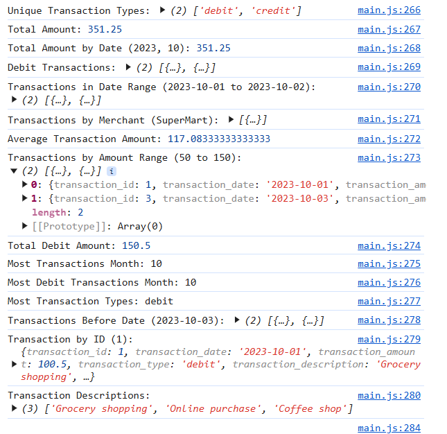
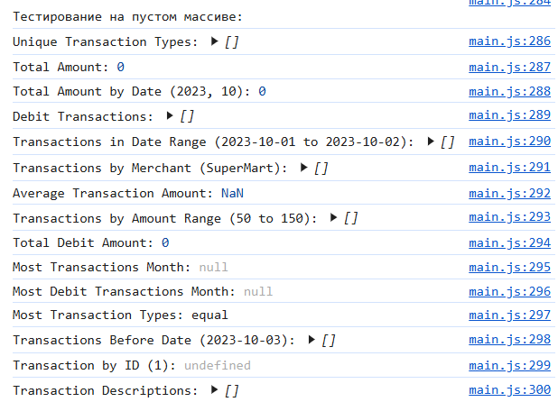
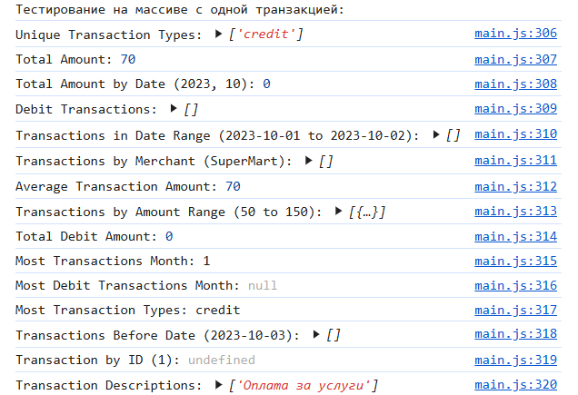

# Лабораторная работа №2. Основы работы с массивами, функциями и объектами в JavaScript

# Анализатор транзакций

## Описание проекта

Консольное приложение для анализа финансовых транзакций. Позволяет фильтровать, анализировать и вычислять различные параметры транзакций, такие как общая сумма, среднее значение, количество транзакций по месяцам и многое другое.

## Структура данных

Каждая транзакция представлена объектом со следующими свойствами:

```json
{
    "transaction_id": 1,
    "transaction_date": "2023-10-01",
    "transaction_amount": 100.50,
    "transaction_type": "debit",
    "transaction_description": "Grocery shopping",
    "merchant_name": "SuperMart",
    "card_type": "debit"
}
```

## Основные функции

### 1. Получение уникальных типов транзакций
```js
function getUniqueTransactionTypes(transactions) {
    const types = new Set(transactions.map(t => t.transaction_type));
    return Array.from(types);
}
```
Возвращает массив уникальных типов транзакций.

### 2. Вычисление общей суммы всех транзакций
```js
function calculateTotalAmount(transactions) {
    return transactions.reduce((sum, t) => sum + t.transaction_amount, 0);
}
```
Возвращает сумму всех транзакций.

### 3. Фильтрация по дате
```js
function calculateTotalAmountByDate(transactions, year, month, day) {
    return transactions.filter(t => {
        const date = new Date(t.transaction_date);
        return (!year || date.getFullYear() === year) &&
               (!month || date.getMonth() + 1 === month) &&
               (!day || date.getDate() === day);
    }).reduce((sum, t) => sum + t.transaction_amount, 0);
}
```
Возвращает сумму транзакций за указанный год, месяц и день.

### 4. Фильтрация по типу транзакции
```js
function getTransactionByType(transactions, type) {
    return transactions.filter(t => t.transaction_type === type);
}
```
Возвращает массив транзакций указанного типа.

### 5. Фильтрация по диапазону дат
```js
function getTransactionsInDateRange(transactions, startDate, endDate) {
    const start = new Date(startDate);
    const end = new Date(endDate);
    return transactions.filter(t => {
        const date = new Date(t.transaction_date);
        return date >= start && date <= end;
    });
}
```
Возвращает транзакции, совершённые в указанном диапазоне дат.

### 6. Фильтрация по продавцу
```js
function getTransactionsByMerchant(transactions, merchantName) {
    return transactions.filter(t => t.merchant_name === merchantName);
}
```
Возвращает массив транзакций, совершённых с указанным продавцом.

### 7. Средняя сумма транзакций
```js
function calculateAverageTransactionAmount(transactions) {
    const total = calculateTotalAmount(transactions);
    return total / transactions.length;
}
```
Возвращает среднюю сумму всех транзакций.

### 8. Фильтрация по диапазону сумм
```js
function getTransactionsByAmountRange(transactions, minAmount, maxAmount) {
    return transactions.filter(t => t.transaction_amount >= minAmount && t.transaction_amount <= maxAmount);
}
```
Возвращает массив транзакций в указанном диапазоне сумм.

### 9. Общая сумма дебетовых транзакций
```js
function calculateTotalDebitAmount(transactions) {
    return getTransactionByType(transactions, "debit").reduce((sum, t) => sum + t.transaction_amount, 0);
}
```
Возвращает сумму всех дебетовых транзакций.

### 10. Месяц с наибольшим количеством транзакций
```js
function findMostTransactionsMonth(transactions) {
    if (transactions.length === 0) {
        return null;
    }
    const monthCounts = {};
    transactions.forEach(t => {
        const month = new Date(t.transaction_date).getMonth() + 1;
        monthCounts[month] = (monthCounts[month] || 0) + 1;
    });
    return Object.keys(monthCounts).reduce((a, b) => monthCounts[a] > monthCounts[b] ? a : b);
}
```
Возвращает номер месяца с наибольшим количеством транзакций.

### 11. Месяц с наибольшим количеством дебетовых транзакций
```js
function findMostDebitTransactionMonth(transactions) {
    const debitTransactions = getTransactionByType(transactions, "debit");
    return findMostTransactionsMonth(debitTransactions);
}
```
Возвращает номер месяца, в котором было больше всего дебетовых транзакций.

### 12. Определение преобладающего типа транзакций
```js
function mostTransactionTypes(transactions) {
    const debitCount = getTransactionByType(transactions, "debit").length;
    const creditCount = getTransactionByType(transactions, "credit").length;
    if (debitCount > creditCount) return "debit";
    if (creditCount > debitCount) return "credit";
    return "equal";
}
```
Определяет, каких транзакций больше — дебетовых или кредитовых.

### 13. Фильтрация транзакций до определённой даты
```js
function getTransactionsBeforeDate(transactions, date) {
    const endDate = new Date(date);
    return transactions.filter(t => new Date(t.transaction_date) < endDate);
}
```
Возвращает транзакции, совершённые до указанной даты.

### 14. Поиск транзакции по ID
```js
function findTransactionById(transactions, id) {
    return transactions.find(t => t.transaction_id === id);
}
```
Возвращает транзакцию по её уникальному идентификатору.

### 15. Получение описаний всех транзакций
```js
function mapTransactionDescriptions(transactions) {
    return transactions.map(t => t.transaction_description);
}
```
Возвращает массив описаний транзакций.

## Тестирование

Приложение протестировано на следующих наборах данных:
- Полный массив транзакций:



- Пустой массив:



- Массив с одной транзакцией:



## Авторы
Разработчик: **[Codjebas Oleg]**

## Контрольные вопросы 

### 1. Какие методы массивов можно использовать для обработки объектов в JavaScript?

Методы массивов для обработки объектов:

`map()`: для преобразования каждого объекта в массиве.

`filter()`: для выбора объектов, соответствующих условию.

`forEach()`: для выполнения операций над каждым объектом.

`reduce()`: для агрегирования данных (например, подсчета суммы).

`some()`, every(): для проверки условий.

`find()`: для поиска первого объекта, соответствующего условию.

`sort()`: для сортировки объектов.

### 2. Как сравнивать даты в строковом формате в JavaScript? 

Чтобы сравнивать даты в строковом формате YYYY-MM-DD, можно использовать обычные операторы сравнения (>, <, >=, <=), так как этот формат позволяет корректное лексикографическое сравнение. Однако если формат даты отличается или требуется более точное сравнение, лучше преобразовать строки в объект Date и сравнивать их.

### 3. В чем разница между map(), filter() и reduce() при работе с массивами объектов?

map() – используется, когда нужно изменить каждый элемент массива и получить новый массив.
filter() – применяется, чтобы оставить только нужные элементы и убрать лишние.
reduce() – помогает получить одно итоговое значение из массива, например сумму или среднее.