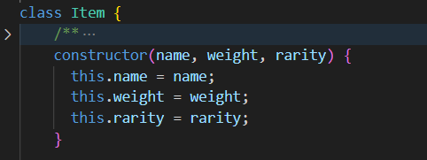
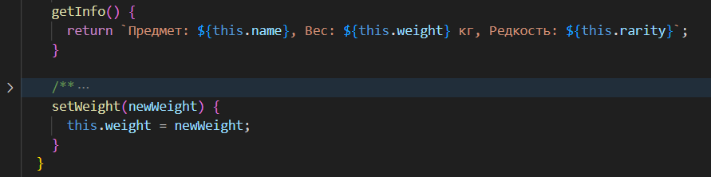
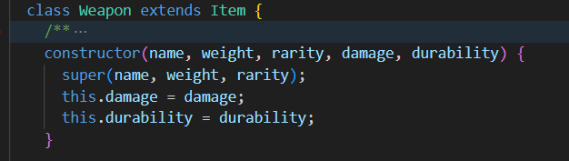
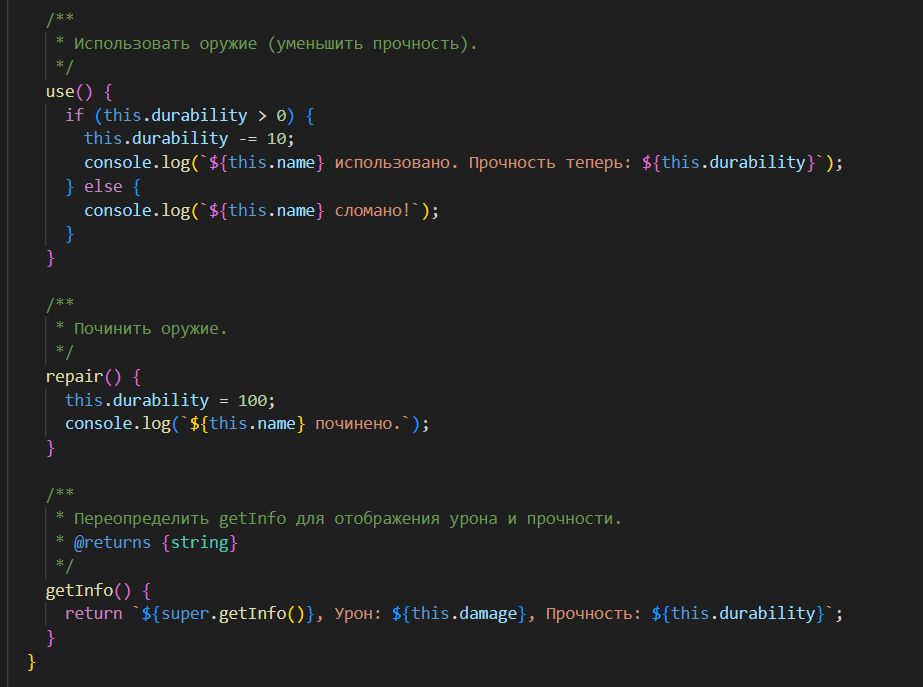
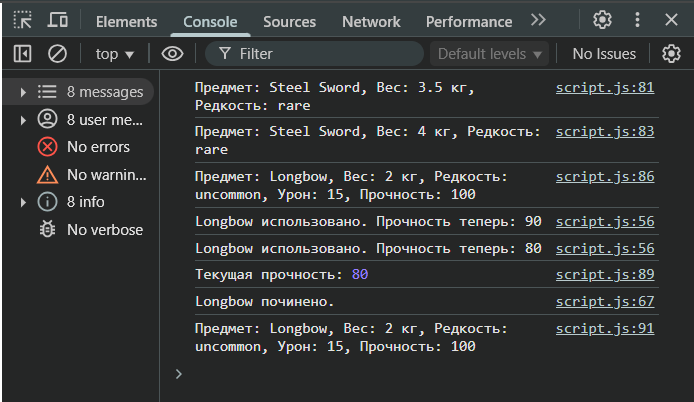

# Лабораторная работа №3: Продвинутые объекты в JavaScript

## Цель работы
Познакомиться с классами и объектами в JavaScript, научиться создавать классы, использовать конструкторы и методы, а также реализовать наследование.

## Условие
Создать консольное приложение, моделирующее систему инвентаря, где можно добавлять предметы, изменять их свойства и управлять ими.

## Реализация

### ✅ Шаг 1. Класс `Item`
Класс `Item` описывает базовый предмет инвентаря с полями:
- `name` — название предмета;
- `weight` — вес предмета;
- `rarity` — редкость (common, uncommon, rare, legendary).



Методы:
- `getInfo()` — возвращает информацию о предмете;
- `setWeight(newWeight)` — изменяет вес предмета.



### ✅ Шаг 2. Класс `Weapon` (наследует `Item`)
Дополнительные поля:
- `damage` — урон;
- `durability` — прочность от 0 до 100.



Методы:
- `use()` — уменьшает прочность на 10;
- `repair()` — восстанавливает прочность до 100;
- `getInfo()` — расширенная информация об оружии.



### ✅ Шаг 3. Тестирование
Созданы экземпляры `Item` и `Weapon`, выполнены вызовы методов:
- отображение информации;
- изменение веса;
- использование и ремонт оружия;
- демонстрация прочности с использованием опциональной цепочки (`?.`).



### ✅ Шаг 4. Функции-конструкторы
Для демонстрации альтернативного подхода классы `Item` и `Weapon` также реализованы с использованием функций-конструкторов и прототипов.

## Используемые технологии
- Язык: **JavaScript**
- Стандарты: **ES6+**
- Стиль документирования: **JSDoc**

## Пример использования

```javascript
const sword = new Item("Steel Sword", 3.5, "rare");
console.log(sword.getInfo());
sword.setWeight(4.0);

const bow = new Weapon("Longbow", 2.0, "uncommon", 15, 100);
bow.use();
bow.repair();
console.log(bow.getInfo());