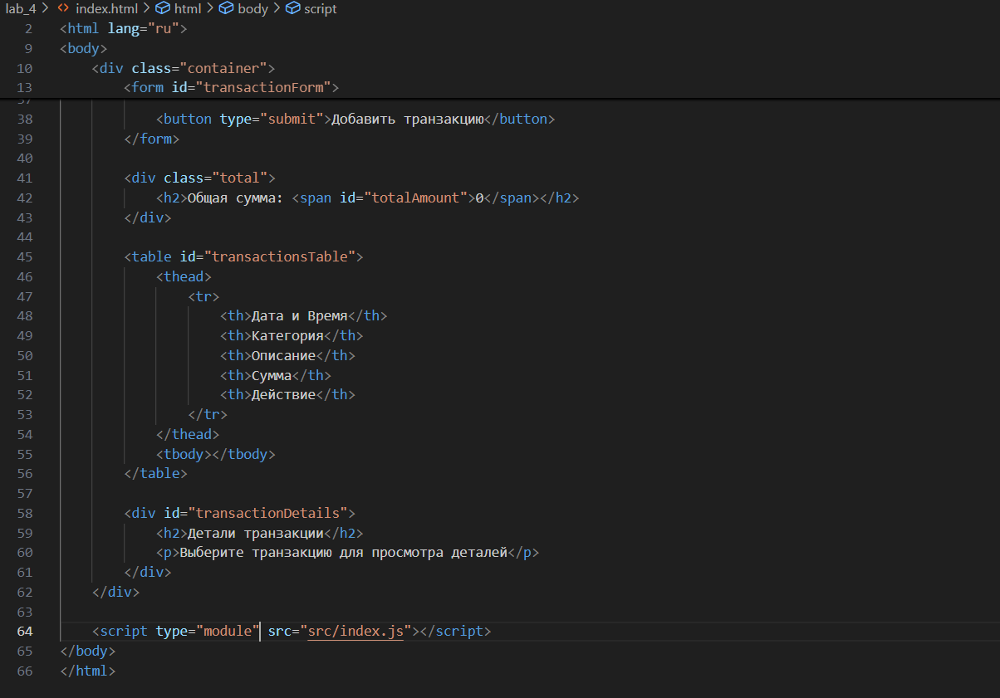
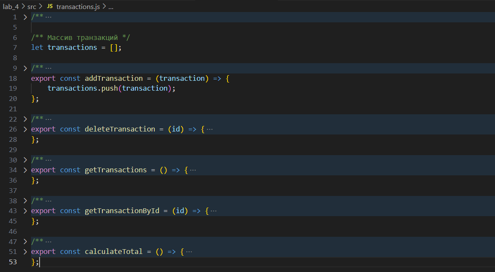
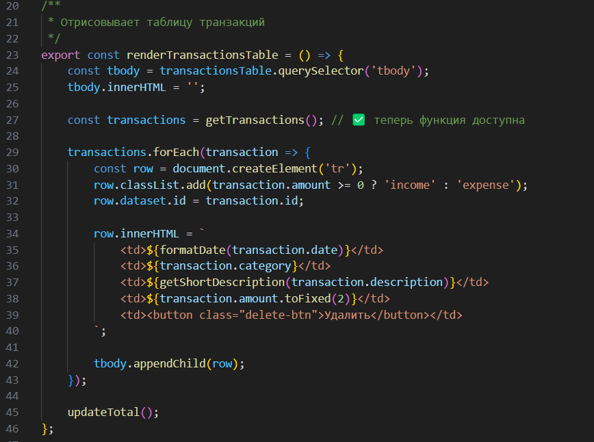
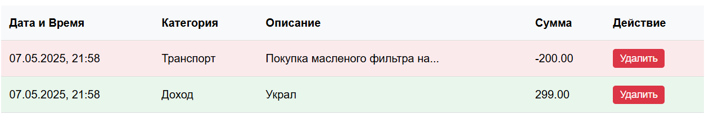
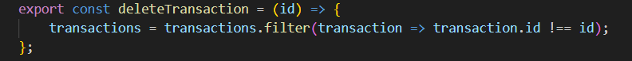
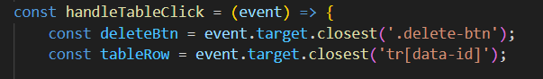
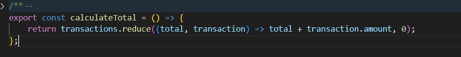
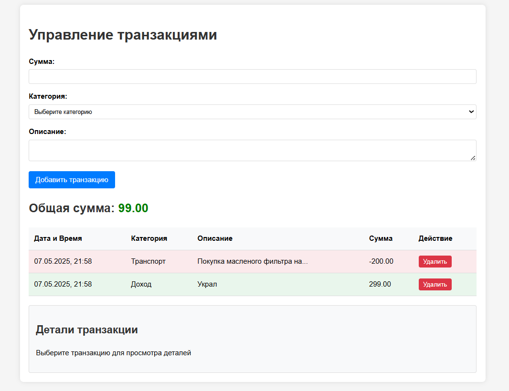

# Лабораторная работа №4. Работа с DOM-деревом и событиями в JavaScript

##  Описание

Ознакомиться с основами взаимодействия JavaScript с DOM-деревом на примере создания простого веб-приложения для учета личных финансов.

##  Содержание
## Шаг 1. Настройка проекта
Создана структура проекта.

index.js подключён к HTML с type="module".

Подключены стили из style.css.

()

## Шаг 2. Представление транзакции

Создан массив transactions.

## Шаг 3. Отображение транзакций
Реализована таблица с колонками:

Дата и время

Категория

Краткое описание

Действие (удаление)

## Шаг 4. Реализована функция addTransaction():

Получает данные из формы

Добавляет транзакцию в массив

Отображает новую строку в таблице

Используется цветовая маркировка: зелёный — доход, красный — расход

## Шаг 5. Управление транзакциями
Добавлены кнопки удаления в таблицу

Удаление происходит через делегирование событий (<table>)

## Шаг 6. Подсчет общей суммы
Реализована функция calculateTotal(), которая суммирует все транзакции и отображает итог на странице.

## Реалицаця программы

## Контрольные вопросы
# - 1. Как получить доступ к элементу на веб-странице с помощью JavaScript?
        
       С помощью методов DOM API:
document.getElementById(), document.querySelector(), document.querySelectorAll() и др.

# - Что такое делегирование событий?

  Делегирование событий — это техника, при которой обработчик события навешивается на родительский элемент, а не на каждый дочерний элемент отдельно. События, такие как клик, "всплывают" вверх по DOM-дереву (event bubbling), что позволяет отлавливать их на более высоком уровне.

# - 3. Как изменить содержимое элемента DOM с помощью JavaScript?

С помощью свойства element.textContent, element.innerHTML или методов appendChild(), removeChild() и др.

# - 3. Как добавить новый элемент в DOM? 

Создать элемент с document.createElement(), задать его свойства и добавить его в нужное место с appendChild() или insertBefore().

